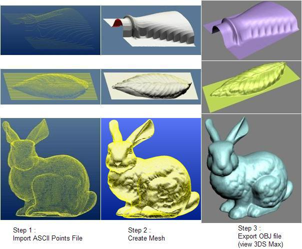



## EGL\_PointCloud V1\.0

### Description

Review project. Create point to mesh and object. Export OBJ 3D model file. Use delaunay triangulation algorithm. Addition mouse buttons and wheel events.(Zip:837kb)
 
### More Info
 

             |
---                |---
**Submitted On**   |2009-08-06 19:14:00
**By**             |[Erkan Sanli](https://github.com/Planet-Source-Code/PSCIndex/blob/master/ByAuthor/erkan-sanli.md)
**Level**          |Intermediate
**User Rating**    |5.0 (35 globes from 7 users)
**Compatibility**  |VB 5\.0, VB 6\.0
**Category**       |[Graphics](https://github.com/Planet-Source-Code/PSCIndex/blob/master/ByCategory/graphics__1-46.md)
**World**          |[Visual Basic](https://github.com/Planet-Source-Code/PSCIndex/blob/master/ByWorld/visual-basic.md)
**Archive File**   |[EGL\_PointC215941872009\.zip](https://github.com/Planet-Source-Code/erkan-sanli-egl-pointcloud-v1-0__1-72339/archive/master.zip)

